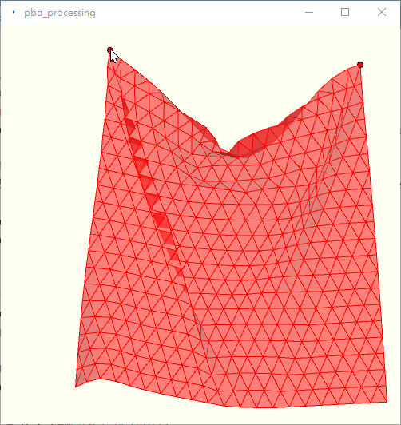

# 實作 Positin Based Dynamics

這是我照著 Position Based Dynamics 論文, 實作出簡單布料模擬。使用 Processing 語言讓我專注實作演算法細節, 並能馬上看到結果。

This is my implementation of Position Based Dynamics. The Processing Language is easy for implementing such algorithm.

## 目前實作進度

半夜心血來潮, 照著 Position Based Dynamics 論文重新實作, 做到 Section 3.3 的簡單 case, 再照著 Yuki Koyama 建立布料的點、線、面規則, 配合2個頂點釘住, 進行 projectConstraints()實作。

使用 mouseDragged() 來移動左上角的頂點, 做出像是絲巾或窗簾動起來的樣子。

使用 P3D 配合 3D座標來模擬, 有加上 lights() 配合 半透明的填充色, 可以看起來立體一點。

使用 stiffness 及 number of solverIterations 算出合適的 k' 修正比例。

## 接下來的規劃
1. 論文中還有其他的 constraints 需要實作
2. Collision Constraints 很重要, 不過可能要花不少時間
3. 不同形狀的布料
4. 繼續細讀論文
